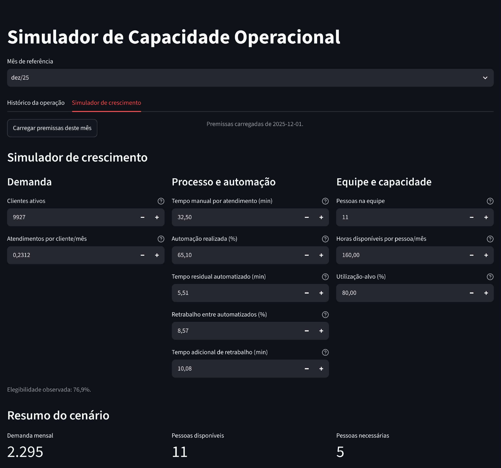

# Operational Capacity Simulator

[Leia em português](README.pt-BR.md) · [Portfolio case in Portuguese](docs/portfolio-case.md) · [Portfolio case in English](docs/portfolio-case.en.md)

**[Open the live demo](https://operational-capacity.streamlit.app/)** · Hosted publicly on Streamlit Community Cloud.

**Author and project lead: Roberto Gianolla Junior**

> “Project conceived and developed under the guidance of Roberto Gianolla Junior, responsible for directing the business problem, following deliveries, and refining the solution.”

## 1. Identified problem

How can an operations team assess whether its current staff can absorb demand growth, and how much automation expands operational capacity? This project addresses that decision problem through a local, deterministic capacity model. It uses **active customers** as the demonstrative unit of the served base and compares a manual counterfactual with a partially automated process.

The data and outputs are synthetic and simulated. They do not describe a real company, realized savings, staffing decisions, or observed business impact.

## 2. Solution objective

The Streamlit application helps managers inspect a synthetic operating history, alter explicit assumptions, compare manual and automated capacity, and project three years of compounded growth. It supports a capacity discussion; it is not a validated statistical forecast, causal inference, queueing model, or optimization algorithm.



*The simulator assumptions and scenario summary shown above use synthetic data.*

## Author’s professional contribution

Roberto Gianolla Junior identified and selected the business problem, defined the decision-support objective, and directed the iterative scope recorded in the project documentation. Concrete examples include choosing **active customers** as the base unit, requiring a distinction between automation eligibility and actual adoption, excluding financial savings and staffing recommendations, and requiring explicit treatment of rework, zero-demand cases, and non-applicable results.

The project history also records guidance to keep the calculation engine independent from the interface, to preserve user-edited scenarios when the reference month changes, and to refine the interface with pt-BR number formatting, percentage-point differences, grouped inputs, and explicit warnings when utilization exceeds its target. These decisions are documented in [docs/decisions.md](docs/decisions.md), [docs/briefing.md](docs/briefing.md), and [docs/interface.md](docs/interface.md).

This statement describes direction, delivery follow-up, requested refinements, and critical interpretation of indicators. It does not claim that the author performed a line-by-line code review, personally executed every automated test, or wrote all code manually.

## 3. Translating the problem into an analytical model

The model is deterministic: the same inputs produce the same outputs.

- **Demand is proportional to the served base:** `D = B × f`, where `B` is active customers and `f` is interactions per active customer per month.
- **Human time after automation is a weighted average:** `t_auto = (1 − a) × t_manual + a × (t_residual + r × t_rework)`. `a` is actual automation adoption, not eligibility. The `r × t_rework` term is the expected additional rework time per automated interaction; it is an expected value and does not require independence between events.
- **Minutes become monthly hours:** `H = D × t / 60`.
- **Capacity and utilization:** planned capacity is `C_plan = P × h × u_target`, while effective utilization is `U_eff = H / (P × h)`. The target is a planning threshold; it is not the same measure as effective utilization.
- **Staffing is discrete:** `P_required = ceil(H / (h × u_target))`. Intermediate calculations keep precision; only the staffing requirement is rounded up.
- **Sustainable demand:** `D_max = C_plan × 60 / t`, when human time is greater than zero.
- **Growth scenarios:** `B_y = B_0 × (1 + g)^y`. Only the base grows compoundingly; all other assumptions remain constant by scenario assumption.

Historical rates are measured from the synthetic data. Simulation values are selected assumptions, even when initialized from a historical month. Automation eligibility is a reference limit; actual adoption is the input used by the engine.

## 4. Relevant decisions and rationale

- **Synthetic, reproducible data:** 24 months and 47,074 fictitious interactions avoid confidential information while allowing reproducible demonstrations.
- **Manual counterfactual:** the monthly manual average is applied to automated interactions. This makes the comparison auditable, but does not establish causality.
- **Rework is additional to residual time:** this avoids double counting.
- **Eligibility differs from adoption:** simulating adoption above observed eligibility requires an explicit expansion assumption.
- **No infinite operational result:** when human time is zero, sustainable capacity and related comparison metrics are shown as not applicable with an explanation.

## 5. Solution verification

Automated tests verify formulas, validation rules, edge cases, compounded projections, CSV contents, deterministic data generation, SQL aggregation, and key Streamlit flows. Known cases verify expected results. The data layer also reconciles the engine’s monthly human hours with the direct sum of interaction times; the documented maximum difference was `1.1368683772161603e-12` hours, consistent with floating-point precision.

Reproduction was checked in a new environment using the documented installation, data generation, test, and Streamlit startup commands. The documented review records a 36-test passing run and HTTP 200 response from a local application server. The author reports that the hosted app loaded without sign-in and that the history, simulator, projections, and downloads worked. This is recorded separately from the HTTP response observed during this review; no interactive browser was available to repeat those flows. Deployment details and verification limits are in [docs/deployment.md](docs/deployment.md).

## 6. Demonstrative scenario

For the verified reference case—10,000 active customers, 0.2 interactions per customer/month, 30 manual minutes, 60% automation, 5 residual minutes, 10% rework with 10 additional minutes, 10 people, 160 available hours/person/month, and 80% target utilization—the model returns:

- 2,000 interactions/month; 15.6 human minutes per interaction after automation;
- 1,000 manual hours versus 520 automated hours; 1,280 planned team hours;
- 62.5% manual versus 32.5% automated effective utilization;
- 8 manual versus 5 automated required people;
- 2,560 manual versus 4,923.076923 automated sustainable interactions/month;
- 480 released human hours and 3.75 equivalent capacity people.

These are simulated outputs used to verify the model, not realized impact.

## 7. Using the results in management decisions

The application distinguishes **capacity increase**—the percentage change in sustainable demand between automated and manual processes—from **growth margin**—the room between sustainable demand and current demand. It also distinguishes continuous **equivalent capacity people** (released hours divided by planned capacity per person) from the integer **required people** count. Neither measure is a layoff, hire, avoided hire, or financial-saving recommendation.

Managers can use the comparison to ask whether a selected growth scenario exceeds the utilization target, when the available team is insufficient, and which assumptions warrant operational validation before a decision.

## 8. Limitations

The model represents human capacity only. It does not model systems, budgets, quality, queues, service levels, lead times, individual productivity, or other constraints. It is not evidence of causal automation gains or a validated forecast. Synthetic data demonstrate the method; they do not calibrate a real operation.

## Architecture and execution

`app.py` is the application entry point. The Streamlit interface composes a pure Python calculation engine, DuckDB-based local CSV queries, and in-memory CSV exports. The synthetic CSVs are versioned in `data/`, so a new clone includes the demonstration data.

Runtime dependencies are `duckdb==1.5.6` and `streamlit==1.64.0`. Python 3.13 is recommended for Linux hosting; the project declares Python 3.11 through 3.14 compatibility. For local Windows execution with the validated Python 3.14.3 environment:

```powershell
py -3.14 -m venv .venv
.\.venv\Scripts\python.exe -m pip install -r requirements-dev.txt
.\.venv\Scripts\python.exe src\operational_capacity\synthetic_data.py --output-dir data
.\.venv\Scripts\python.exe -m pytest
.\.venv\Scripts\python.exe -m streamlit run app.py
```

For details, see [data documentation](docs/data.md), [interface documentation](docs/interface.md), and the [review record](docs/review.md).

## AI support

“AI tools supported model structuring, implementation, and technical review, under the author’s guidance.” The project was conceived and led by Roberto Gianolla Junior, with iterative delivery assessment, result verification, and user-experience refinement. AI is not presented as the principal author, and synthetic outputs are not presented as real business impact.
